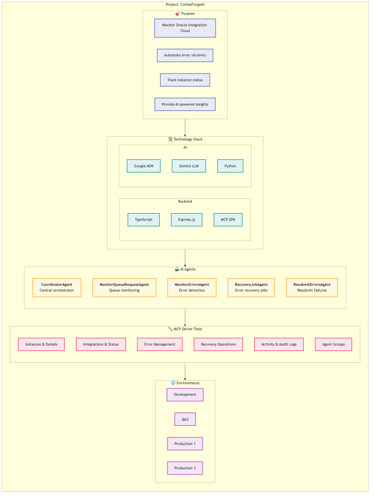

# OICAgentOps - Project Description

## Overview



---

## 🎯 Purpose

OICAgentOps is designed to:

1. **Monitor Oracle Integration Cloud** - Real-time visibility into OIC instances, integrations, and activity
2. **Automate Error Recovery** - Intelligent detection and automated recovery of failed integrations
3. **Track Instance Status** - Comprehensive tracking of instance lifecycle and states
4. **Provide AI-Powered Insights** - Leverage Gemini LLM for intelligent analysis and recommendations

---

## 🛠️ Technology Stack

### Backend
| Technology | Purpose |
|------------|---------|
| TypeScript | Primary language for MCP server |
| Express.js | HTTP server framework |
| MCP SDK | Model Context Protocol implementation |

### AI
| Technology | Purpose |
|------------|---------|
| Google ADK | Agent Development Kit for building AI agents |
| Gemini LLM | Large language model for intelligent processing |
| Python | Agent implementation language |

---

## 🤖 AI Agents

### CoordinatorAgent
Central orchestrator that manages and coordinates all monitoring operations.

### MonitorQueueRequestAgent
Monitors the OIC instance queue, tracking pending and in-progress requests.

### MonitorErrorsAgent
Detects integration errors and provides detailed error analysis.

### RecoveryJobAgent
Manages error recovery jobs, tracking their status and execution.

### ResubmitErrorsAgent
Handles the resubmission of failed integration instances.

---

## 🔧 MCP Server Tools

| Category | Tools |
|----------|-------|
| **Instances & Details** | `monitoringInstances`, `monitoringInstanceDetails` |
| **Integrations & Status** | `monitoringIntegrations`, `monitoringIntegrationDetails` |
| **Error Management** | `monitoringErroredInstances`, `monitoringErroredInstanceDetails` |
| **Recovery Operations** | `monitoringErrorRecoveryJobs`, `monitoringResubmitErroredInstance` |
| **Activity & Audit Logs** | `monitoringActivityStream`, `monitoringAuditRecords`, `monitoringLogs` |
| **Agent Groups** | `monitoringAgentGroups`, `monitoringAgentsInGroup` |

---

## 🌐 Environments

| Environment | Purpose |
|-------------|---------|
| **Development** | Local development and testing |
| **QA3** | Quality assurance testing |
| **Production 1** | Primary production environment |
| **Production 3** | Secondary production environment |

---

## Getting Started

1. **Start MCP Server**:
   ```bash
   cd MCPServers/oic-monitor-server
   npm install && npm start
   ```

2. **Run an Agent**:
   ```bash
   cd Agents/MonitorQueueRequestAgent
   python agent.py
   ```

3. **Configure Environment**:
   - Set up `.env` files for each environment
   - Configure OIC credentials and API endpoints

