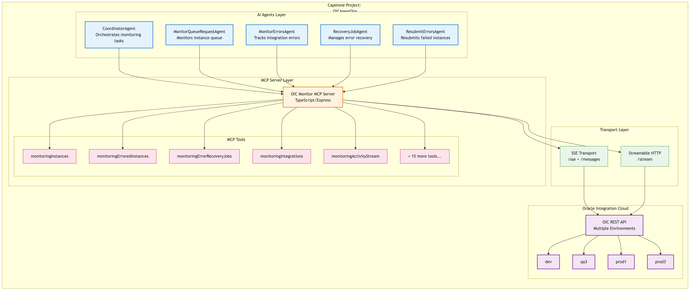

# OICAgentOps - AI-Powered Operations for Oracle Integration Cloud

---

## Problem Statement

Oracle Integration Cloud (OIC) is a critical middleware platform that handles thousands of integration instances daily across multiple environments (dev, QA, production). Operations teams face significant challenges:

- **Manual Monitoring Burden**: Teams must constantly monitor dashboards for failed integrations, stuck instances, and error patterns across multiple OIC environments
- **Delayed Error Response**: Errors often go unnoticed for hours, leading to data inconsistencies and business disruptions
- **Repetitive Recovery Tasks**: Resubmitting failed instances, triggering recovery jobs, and managing agent states requires manual intervention
- **Context Switching**: Operators must navigate multiple screens, environments, and APIs to diagnose and resolve issues
- **24/7 Coverage Gap**: Integration failures don't wait for business hours, but human operators aren't always available

**Why it matters**: Failed integrations can halt business processes, corrupt data, and cause revenue loss. The faster issues are detected and resolved, the lower the business impact.

---

## Why Agents?

AI agents are the ideal solution for OIC operations because:

1. **Autonomous Monitoring**: Agents can continuously watch for errors without fatigue, instantly detecting anomalies that humans might miss

2. **Intelligent Decision Making**: Unlike simple scripts, agents can understand context—deciding whether to auto-recover, escalate, or gather more information before acting

3. **Natural Language Interface**: Operators can ask questions like "What's failing in production?" instead of navigating complex dashboards

4. **Multi-Step Reasoning**: Agents can chain actions—detect error → analyze root cause → check if recovery job exists → create one if needed → monitor resolution

5. **Learning and Adaptation**: Agents can recognize patterns across incidents and suggest proactive measures

6. **Tool Orchestration**: Through MCP (Model Context Protocol), agents can seamlessly invoke 20+ OIC monitoring and management tools as needed

---

## What You Created

### Overall Architecture



**Three-Layer Architecture:**

```
┌─────────────────────────────────────────────────────────────────┐
│                      AI AGENTS LAYER                            │
│  ┌──────────────┐ ┌──────────────┐ ┌──────────────────────────┐ │
│  │ Coordinator  │ │ MonitorQueue │ │ MonitorErrors            │ │
│  │    Agent     │ │ RequestAgent │ │ Agent                    │ │
│  └──────────────┘ └──────────────┘ └──────────────────────────┘ │
│  ┌──────────────┐ ┌──────────────────────────────────────────┐  │
│  │ RecoveryJob  │ │ ResubmitErrorsAgent                      │  │
│  │    Agent     │ │                                          │  │
│  └──────────────┘ └──────────────────────────────────────────┘  │
└─────────────────────────────────────────────────────────────────┘
                              │
                              ▼
┌─────────────────────────────────────────────────────────────────┐
│                     MCP SERVER LAYER                            │
│  ┌────────────────────────────────────────────────────────────┐ │
│  │           OIC Monitor MCP Server (TypeScript)              │ │
│  │  ┌─────────────────┐ ┌─────────────────┐ ┌──────────────┐  │ │
│  │  │ monitoringInst- │ │ monitoringError │ │ monitoring-  │  │ │
│  │  │ ances           │ │ edInstances     │ │ RecoveryJobs │  │ │
│  │  └─────────────────┘ └─────────────────┘ └──────────────┘  │ │
│  │  ┌─────────────────┐ ┌─────────────────┐ ┌──────────────┐  │ │
│  │  │ monitoringInteg │ │ monitoringActiv │ │ 15+ more     │  │ │
│  │  │ rations         │ │ ityStream       │ │ tools...     │  │ │
│  │  └─────────────────┘ └─────────────────┘ └──────────────┘  │ │
│  └────────────────────────────────────────────────────────────┘ │
│           SSE Transport  │  Streamable HTTP Transport           │
└─────────────────────────────────────────────────────────────────┘
                              │
                              ▼
┌─────────────────────────────────────────────────────────────────┐
│                 ORACLE INTEGRATION CLOUD                        │
│     ┌─────┐    ┌─────┐    ┌───────┐    ┌───────┐               │
│     │ dev │    │ qa3 │    │ prod1 │    │ prod3 │               │
│     └─────┘    └─────┘    └───────┘    └───────┘               │
└─────────────────────────────────────────────────────────────────┘
```

### Components

| Component | Purpose |
|-----------|---------|
| **CoordinatorAgent** | Central orchestrator that delegates tasks to specialized agents |
| **MonitorQueueRequestAgent** | Monitors instance queues, tracks in-progress and pending requests |
| **MonitorErrorsAgent** | Detects failed integrations, analyzes error patterns |
| **RecoveryJobAgent** | Creates and monitors error recovery jobs |
| **ResubmitErrorsAgent** | Resubmits failed instances for reprocessing |
| **MCP Server** | Exposes 20+ OIC operations as tools via Model Context Protocol |

---

## Demo

### Scenario 1: Error Detection and Analysis
```
User: "What integrations are failing in production?"

Agent: I found 12 failed instances in prod1:
  - ORDER_SYNC_TO_ERP: 8 failures (timeout errors)
  - CUSTOMER_UPDATE: 3 failures (validation errors)  
  - INVOICE_PROCESS: 1 failure (connection refused)

The ORDER_SYNC failures started 30 minutes ago and appear 
related to ERP system slowness. Would you like me to:
1. Create a recovery job for these?
2. Get detailed error logs?
3. Check if there's already a recovery in progress?
```

### Scenario 2: Automated Recovery
```
User: "Resubmit all failed ORDER_SYNC instances from the last hour"

Agent: Resubmitting 8 failed ORDER_SYNC instances...
  ✓ Instance ID abc123 - Resubmitted
  ✓ Instance ID def456 - Resubmitted
  ✓ Instance ID ghi789 - Resubmitted
  ... (5 more)

All 8 instances have been resubmitted. I'll monitor their 
progress and notify you if any fail again.
```

### Scenario 3: Proactive Monitoring
```
Agent (Autonomous Alert): 
⚠️ Detected unusual pattern in prod3:
- 15 instances stuck in IN_PROGRESS for >30 minutes
- Normally complete in <2 minutes
- Affected integration: PAYMENT_GATEWAY_SYNC

Recommendation: The downstream payment service may be 
unresponsive. Should I abort stuck instances and alert 
the payment team?
```

---

## The Build

### Technology Stack

| Layer | Technology | Purpose |
|-------|------------|---------|
| **AI/LLM** | Google Gemini | Natural language understanding and reasoning |
| **Agent Framework** | Google ADK (Agent Development Kit) | Agent orchestration and tool integration |
| **Protocol** | Model Context Protocol (MCP) | Standardized tool invocation |
| **MCP Server** | TypeScript + Express.js | RESTful API to MCP bridge |
| **Transport** | SSE + Streamable HTTP | Real-time bidirectional communication |
| **Target API** | Oracle Integration Cloud REST API | Integration monitoring and management |

### MCP Tools Implemented (20+)

```
Monitoring:
  - monitoringInstances          - monitoringInstanceDetails
  - monitoringIntegrations       - monitoringIntegrationDetails
  - monitoringErroredInstances   - monitoringErroredInstanceDetails
  - monitoringActivityStream     - monitoringActivityStreamDetails
  - monitoringScheduledRuns      - monitoringHistory
  - monitoringLogs               - monitoringAuditRecords
  - monitoringMessageCountSummary

Agent Management:
  - monitoringAgentGroups        - monitoringAgentGroupDetails
  - monitoringAgentsInGroup      - monitoringAgentDetails

Recovery Operations:
  - monitoringErrorRecoveryJobs  - monitoringErrorRecoveryJobDetails
  - monitoringResubmitErroredInstance
  - monitoringResubmitErroredInstances
  - monitoringDiscardErroredInstance
  - monitoringDiscardErroredInstances
  - monitoringAbortInstance
```

### Key Implementation Details

1. **Token Caching**: OAuth tokens cached with automatic refresh to minimize auth overhead
2. **Pagination Handling**: Custom pagination logic to handle Oracle's 500-record offset limit
3. **Multi-Environment Support**: Single server supports dev/qa/prod environments via config
4. **Error Retry Logic**: Exponential backoff with automatic token refresh on 401 errors
5. **Dual Transport**: Supports both SSE and Streamable HTTP for client flexibility

---

## If I Had More Time, This Is What I'd Do

### 1. **Autonomous Agent Loop**
- Implement scheduled monitoring every 5 minutes
- Auto-detect anomalies and trigger recovery without human intervention
- Build learning system to recognize recurring issues

### 2. **Predictive Analytics**
- Analyze historical failure patterns
- Predict likely failures before they occur
- Suggest proactive maintenance windows

### 3. **Multi-Agent Collaboration**
- Enable agents to communicate and coordinate
- Implement supervisor agent for complex multi-step recoveries
- Add conflict resolution when agents have competing actions

### 4. **Integration Lifecycle Management**
- Add tools for activate/deactivate integrations
- Implement export/import integration packages
- Enable start/stop of OIC connectivity agents

### 5. **Observability Dashboard**
- Build real-time web dashboard showing agent activities
- Visualize error trends and recovery success rates
- Create alerting integrations (Slack, PagerDuty, email)

### 6. **Security Enhancements**
- Implement approval workflows for destructive operations
- Add audit logging for all agent actions
- Role-based access control for different agent capabilities

### 7. **Extended Platform Support**
- Add support for Oracle SOA Suite
- Integrate with Oracle API Gateway
- Connect to Oracle Autonomous Database for data validation

---

## Repository

**GitHub**: [https://github.com/nareshsaladi2024/OICAgentOps](https://github.com/nareshsaladi2024/OICAgentOps)

---

*Built with Google ADK, Gemini, and Model Context Protocol*

